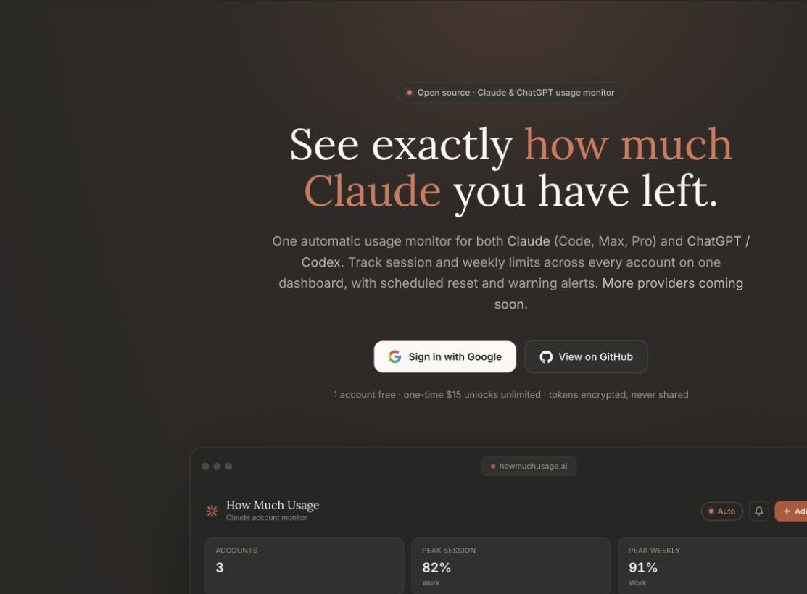

# How Much AI

How Much AI is a self-hosted dashboard for subscription usage limits across multiple AI accounts. It currently tracks Claude (Anthropic) and ChatGPT/Codex (OpenAI), refreshes readings automatically, and can send reset or high-usage alerts.

This repository is the open-source, single-tenant edition. It has no hosted sign-in, billing, marketing site, analytics, or provider lock. You run it, choose where its encrypted vault is stored, and control every secret it uses.

> How Much AI is unofficial and is not affiliated with Anthropic or OpenAI.

[](https://howmuchusage.ai/)

*Preview the managed version at [howmuchusage.ai](https://howmuchusage.ai/). This repository remains free to self-host with unlimited accounts.*

## Self-hosted or managed

Self-hosting is free, has no account limit, and keeps the application and infrastructure under your control. If you do not want to operate it, the managed versions include one account free and use a one-time unlock instead of a subscription:

| Managed version | Providers | Unlimited-account unlock |
| --- | --- | --- |
| [How Much Usage](https://howmuchusage.ai/) | Claude and ChatGPT/Codex | **$15 once** |
| [How Much Claude](https://howmuchclaude.com/) | Claude | **$9 once** |
| [How Much Codex](https://howmuchcodex.com/) | ChatGPT/Codex | **$9 once** |

The managed fee pays for the hosted service. It is not a license fee for this MIT-licensed repository.

## Quick start

You need Node.js 22.18.0 or newer.

```bash
git clone https://github.com/SeraphKc/how-much-ai.git
cd how-much-ai
npm ci
npm run dev
```

Open [http://localhost:3000](http://localhost:3000). With no environment variables, the dashboard is intentionally open and stores accounts in an encrypted local vault under `.data/`.

That zero-configuration mode is suitable only for your own computer or a trusted private network. Set `APP_PASSWORD` before making the app reachable by anyone else.

## Set up with an AI coding agent

Give your agent this brief after cloning the repository:

> Set up How Much AI locally. Read `AGENTS.md` before changing anything. Run `npm ci`, then `npm run dev`, and use only credentials and infrastructure created for this installation. Do not import environment values, Convex deployments, vault data, or provider credentials from another project. Copy `.env.example` to `.env.local` only if configuration is needed. Before finishing, run `npm test`, `npm run typecheck`, and `npm run build`.

[`AGENTS.md`](AGENTS.md) contains the product boundary, architecture map, security invariants, and validation rules for Codex, Claude Code, Cursor, and other repository-aware agents.

## Connect accounts

Click **Connect account**, then choose a provider:

- **Claude** — use the private app sign-in flow and paste the returned `code#state`. A same-machine Claude Code login and Convex-backed device pairing are also available as convenience options. `claude setup-token` is inference-only and cannot read the subscription-usage endpoint.
- **ChatGPT/Codex** — read the Codex login from the machine running the app or paste the contents of `~/.codex/auth.json`.

Credentials are encrypted in the server-side vault and are never returned to the browser after connection. Local and device-pairing shortcuts may share a rotating CLI credential; the provider-specific private sign-in is the more durable choice when available.

Same-machine CLI discovery is automatic in development. In a production-mode local install it requires `ENABLE_LOCAL_CONNECT=1`; never enable that route on a remote server.

## Choose a storage mode

The server selects one backend from the environment:

| Backend | Configuration | Best for | Notifications |
| --- | --- | --- | --- |
| Encrypted file | No variables | One persistent machine | No |
| Convex | `CONVEX_URL` + `VAULT_ACCESS_SECRET` | Durable or multi-instance hosting | Yes |
| Redis/KV REST | URL + token + `VAULT_ENCRYPTION_SECRET` | Durable hosting without Convex | No |

Local file storage creates `.data/vault.enc` and `.data/vault.key`. Back up the whole `.data` directory; the encrypted vault cannot be recovered without its matching key or configured encryption secret.

See [Self-hosting](docs/SELF_HOSTING.md) for complete Convex, Redis, notification, backup, reverse-proxy, and production instructions. Every supported variable is documented in [`.env.example`](.env.example).

### Bring your own Convex project

Convex is optional for basic local use. Choose it when you want durable remote storage, multi-instance coordination, device pairing, or scheduled notifications.

```bash
npx convex dev
npx convex env set VAULT_ACCESS_SECRET
```

The first command creates or selects a Convex project and writes its generated deployment configuration to `.env.local`. Create a new strong `VAULT_ACCESS_SECRET` for this installation, use the same value in `.env.local`, and let the second command prompt for it so it does not enter your shell history. Never reuse the maintainer's or another installation's deployment, URL, or secret.

For production deployment, scheduler configuration, notifications, secret rotation, and backups, follow the complete [BYO Convex instructions](docs/SELF_HOSTING.md#6-storage-option-b-convex).

## Put it on a network safely

Copy the example environment file and replace the blank values you need:

```bash
cp .env.example .env.local
```

At minimum, a networked deployment should set independent strong values for:

```dotenv
APP_PASSWORD=
AUTH_SECRET=
VAULT_ENCRYPTION_SECRET=
```

Then verify and build:

```bash
npm ci
npm test
npm run typecheck
npm run build
npm start
```

Terminate TLS at a trusted reverse proxy or hosting platform. Keep `TRUST_PROXY_IP_HEADERS=0` unless that proxy overwrites the forwarded client-IP headers itself. Serverless platforms must use Convex or Redis because their local filesystems are not durable.

## Notifications

Notifications require Convex because their configuration, detector state, subscriptions, lease, and five-minute scheduler are stored there. Available delivery channels are:

- browser Web Push;
- Telegram;
- a generic JSON webhook.

Redis-only and file-only installs still provide the complete dashboard, provider tracking, encrypted credentials, refresh coordination, and local countdowns; the notification panel will explain that Convex is required for alerts.

## Development

Run all checks from the repository root:

```bash
npm ci
npm test
npm run typecheck
npm run build
```

The build also checks that local vault material was not copied into the production output. Contributor and AI-agent rules are in [AGENTS.md](AGENTS.md). CI runs the same commands on every push and pull request.

## Security and license

Do not commit `.env*`, `.data/`, provider credentials, database tokens, or generated vault backups. If you find a vulnerability, follow [SECURITY.md](SECURITY.md) and do not publish credential material in an issue.

How Much AI is released under the [MIT License](LICENSE).
